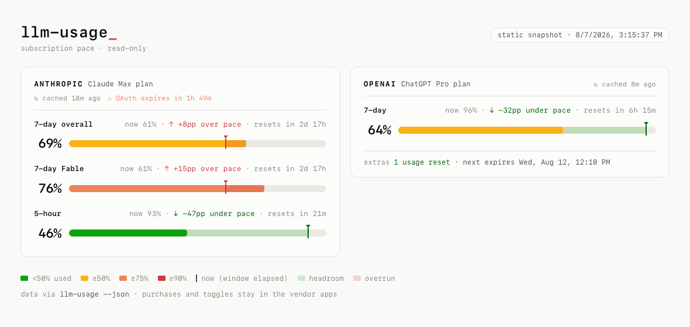

# llm-usage

A terminal dashboard for your **Anthropic (Claude)** and **OpenAI (ChatGPT/Codex)** subscription rate limits — the same numbers Claude Code's `/usage` command and the Codex CLI report, side by side, sized to your terminal. Provider-specific usage credits, spending, reset credits, and scoped limit groups are included when the usage endpoints report them.

```text
ANTHROPIC  Claude Max Plan  [⚠ OAuth expires in 3h 19m]      Wed Jun 03 13:51 MDT
──────────────────────────────────────────────────────────────────────────────────
  ● Service status: Partial System Outage
                                           45%  ▼  ↑ +12pp over pace · in 3d 20h
7-day overall  57% ███████████████████████████████░░░░░░░░░░░░░░░░░░░░░
                          18%  ▼  ↓ -6pp under pace · in 4h 10m
5-hour         12% ████████░░░░░░░░░░░░░░░░░░░░░░░░░░░░░░░░░░░░░░░░░░░

══════════════════════════════════════════════════════════════════════════════════

OPENAI  ChatGPT Pro Plan                                     Wed Jun 03 13:52 MDT
──────────────────────────────────────────────────────────────────────────────────
  ...

Used: █ ok  █ 50%  █ 75%  █ 90%
Pace: ▼ under  ▼ on  ▼ over
```

## Reading the display

Each rate-limit band is a bar with a marker above it:

- **The bar** shows what percentage of the limit you've consumed, colored green → yellow → orange → red as it fills.
- **The `▼` marker** sits at the percentage of the *time window* that has elapsed — i.e., where "now" is, with that percentage printed to its left.

The relationship between the two is the real signal:

| Pattern | Meaning |
|---|---|
| Bar ends **past** the `▼` (red `▼`, `↑ over pace`) | Burning faster than the window — you'll hit the limit before it resets |
| Bar ends **before** the `▼` (green `▼`, `↓ under pace`) | Headroom — usage is slower than time |
| Bar ends **at** the `▼` (white `▼`, `≈ on pace`) | Within ±5 percentage points of even burn |

Each band also shows its time remaining. A red `↑` after a bar means usage reported over 100%.

The dashboard checks the public [Anthropic](https://status.claude.com/) and
[OpenAI](https://status.openai.com/) status feeds. Operational status stays
quiet; an active disruption appears directly below the affected provider
heading, colored yellow for a minor incident and red for a major or critical
incident. Status monitoring is independent of authentication and does not
consume model API quota.

OAuth token expiry is shown only when a provider token is expired or has 4 hours
or less remaining, with a red warning inside 1 hour. Expiry and cache notices
appear inline on the provider title line.

Each provider can add an `Extras:` line. Anthropic shows it only when usage
credits are enabled, have recorded spending, or need attention; ordinary
disabled states stay hidden. OpenAI reports purchased-credit status and
available usage-limit resets. When the installed Codex app server supplies
complete reset-credit details, the earliest expiration is shown in local time
and urgency-colored; expirations within three days also include a relative
countdown. The tool falls back to the count when details are unavailable,
incomplete, or have no expiration. Named model/feature-specific limits appear
alongside the shared windows. The dashboard is read-only: manage Anthropic
usage credits in Claude settings and redeem OpenAI resets in Codex itself.

## Model choice and usage

OpenAI normalizes the different costs of Sol, Terra, Luna, reasoning effort,
tool use, and task complexity into the percentages returned by its usage
service. The dashboard therefore treats those percentages as authoritative
instead of estimating messages remaining from published ranges. `max` can use
more reasoning, and `ultra` coordinates multiple agents, so either can change
your burn rate substantially even when the underlying limit windows stay the
same.

Anthropic likewise reports normalized utilization for the shared session,
weekly, and model/surface-scoped limits. Current `limits[]` entries are treated
as authoritative, with the older named response fields retained as fallbacks.
Usage-credit spending is separate from included-plan utilization and is shown
without inventing a reset schedule the endpoint does not provide.

## Installation

Copy (or symlink) the script anywhere on your `PATH`:

```sh
ln -s "$PWD/llm-usage" ~/bin/llm-usage
```

Requirements: **Python 3.8+**, nothing else — no third-party packages.

Run the stdlib-only fixture tests from the repository root:

```sh
python3 -m unittest discover -s tests -v
```

## Interactive TUI

Run `llm-usage --tui` for an interactive, full-terminal view. It uses Python's
stdlib `curses` module, so it requires an interactive terminal; if stdout is not
a TTY, it exits with code `2`.

The TUI adapts to the live window width and scrolls vertically when the content
is taller than the window. Controls: `↑`/`k`, `↓`/`j`, `PageUp`, `PageDown`,
`Home`, `End`, mouse wheel when supported, and `q`, `Esc`, or `Ctrl-C` to quit.

Data refreshes happen when the relevant cache or rate-limit backoff window
expires. The screen also repaints every 60 seconds, plus immediately on resize
or scroll, so countdowns like OAuth expiry, reset times, and cached-response
ages stay current without extra API calls.

`--tui` and `--json` are mutually exclusive; combining them exits with code `2`.
`--fresh` works with `--tui` as an initial cache-read bypass only, then the TUI
returns to normal cache-aware refresh behavior.

## HTML dashboard

<picture>
  <source media="(prefers-color-scheme: dark)" srcset="docs/html-dashboard-dark.png">
  
</picture>

`llm-usage --html` serves a display-only browser dashboard from a loopback HTTP
server and opens it in your preferred browser. Each limit window is the CLI's
pace instrument translated to the page: a status-colored usage fill, a thin
"now" tick at the percent-of-window-elapsed position, and the interval between
them painted as green headroom or red overrun. The page follows the system
light/dark color mode, adapts from phone-narrow to wide windows, and has no
interactive controls.

The page re-renders locally every second (countdowns, tick creep, cache ages)
and polls the server every 60 seconds. Each poll runs `llm-usage --json` as a
subprocess, so the page consumes exactly the same cache-aware source of truth
as every other consumer — the provider endpoints are still hit at most once
per TTL window no matter how long the page stays open. `--fresh` applies to
the initial load only. The server runs until you stop the original invocation
with `Ctrl-C` (exit `0`); if the page loses its server it shows a
`source offline` chip and keeps displaying the last data.

`llm-usage --html-static <path>` instead writes one self-contained snapshot
page (payload embedded, no polling) to `<path>` and prints the absolute path —
useful for agents that want to open or screenshot the dashboard. Its exit code
follows the usual `0/1/2` provider semantics.

`--tui`, `--json`, `--html`, and `--html-static` are mutually exclusive;
combining them exits with code `2`.

## JSON output

`llm-usage --json` emits normalized provider windows for scripts and schedulers.
Every window carries `utilization` plus reset timing, and — where known — its
`window_seconds` length so consumers can compute pace; Anthropic windows also
carry a display `label`, and each provider object reports `oauth_expires_at_ms`
for the credential it used. The Anthropic object also includes normalized
`usage_credits` and limit metadata
such as `kind`, `is_active`, and `severity`. The OpenAI object includes
`additional_rate_limits`, `credits`, and `rate_limit_reset_credits`. Reset-credit
output includes `details_complete`, `next_expires_at`, and
`next_expires_in_seconds`; expiration fields are `null` unless every available
credit has a reported expiration. Relative reset countdowns are reduced by the
age of the cached response; `reset_at`, when provided, remains the authoritative
absolute timestamp. Both provider objects include a normalized `service_status`
object with availability, operational state, incident indicator and description,
affected components, cache age, staleness, and any refresh error.

## Authentication

The tool reuses the OAuth credentials your existing CLI logins already created. No separate setup is needed if you use Claude Code and/or the Codex CLI.

**Anthropic** (first match wins):
1. `$CLAUDE_CODE_OAUTH_TOKEN`
2. macOS Keychain entry `Claude Code-credentials`
3. `~/.claude/.credentials.json`

**OpenAI/Codex** (first match wins):
1. `$CODEX_OAUTH_TOKEN`
2. `~/.codex/auth.json`

If a token is missing or rejected, run `claude` or `codex` once to log in / refresh, then re-run `llm-usage`.

Tokens are read locally and sent only to the respective vendor's own API. OpenAI token expiry is determined by decoding the JWT locally (inspection only — never verified, never sent anywhere else).

For OpenAI accounts loaded from `~/.codex/auth.json`, `llm-usage` also makes an
optional, read-only `account/rateLimits/read` request through the installed
[Codex app server](https://learn.chatgpt.com/docs/app-server#6-rate-limits-chatgpt).
This supplies per-reset expiration timestamps that the direct usage response
omits. Missing or older Codex installations continue to show the aggregate
reset count, and `$CODEX_OAUTH_TOKEN` is never mixed with a potentially different
account from the local Codex login.

## Caching

The undocumented usage endpoints are rate-limited, so `llm-usage` calls each provider's API **at most once per success window**. Every successful response is cached on disk per provider; any run inside the TTL is served from cache with no network call and annotated `↻ cached Nm ago` on the provider title line.

- **Success TTL:** provider-specific by default — **600 seconds (10 minutes) for OpenAI**, but **1200 seconds (20 minutes) for Anthropic**, whose usage endpoint rate-limits more aggressively. Override with `LLM_USAGE_CACHE_TTL=<seconds>`, which takes manual control and applies to **both** providers as-is (set `0` to disable caching entirely).
- **Rate-limit backoff:** if a provider returns **429**, that's *negatively* cached for **20 minutes** by default — the tool makes **no new call** to that provider for the whole window, so repeatedly running it won't keep poking a limited endpoint and prolong the block. The provider title line shows `● rate limited (429) … retry in Nm` instead. Override with `LLM_USAGE_RATE_LIMIT_TTL=<seconds>`.
- **Bypass for one run:** `llm-usage --fresh` (alias `--no-cache`, or `LLM_USAGE_NO_CACHE=1`) hits the APIs live and refreshes the cache — including overriding an active 429 backoff.
- **Other failures aren't cached** — a 401/network error retries on your next run rather than sticking around.
- **Location:** `$XDG_CACHE_HOME/llm-usage/` (default `~/.cache/llm-usage/`).
- The `--json` output includes `cached`, `cache_age_seconds`, and `rate_limited` per provider, plus Anthropic usage-credit spending and OpenAI credit/reset counts and the next complete-detail reset expiration on successful responses.

Public status feeds have their own persistent cache and failure policy:

- **Success TTL:** **60 seconds** by default. Override it with
  `LLM_USAGE_STATUS_TTL=<seconds>`.
- **Conditional refreshes:** Anthropic responses supply an `ETag`, which is
  reused with `If-None-Match` after the cache expires.
- **Failure backoff:** network, server, and malformed-response failures retain
  the last known state and retry after approximately 5 minutes, then 15 minutes,
  then 1 hour. An HTTP `Retry-After` header takes precedence.
- **No false reassurance:** a failed refresh never becomes “operational.” The
  dashboard either labels the last known state as stale or reports status as
  unavailable. Status failures do not suppress valid usage data or change the
  process exit code.
- `--fresh` also bypasses an active status cache/backoff for that one run.
  `LLM_USAGE_CACHE_TTL=0` disables both usage and status caching.

## Failure behavior

Each provider section renders independently: a missing token, expired credential, network failure, or API error in one section degrades to an inline error line while the other section still renders fully. (The Anthropic usage endpoint occasionally returns a transient 429 — just re-run.)

**Exit codes:** `0` both providers OK · `1` one provider failed · `2` both failed · `130` interrupted · `141` broken pipe (e.g. piped to `head`).

## License

MIT — see [LICENSE](LICENSE).
